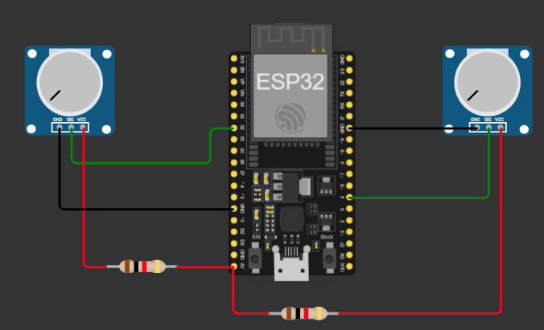

# *ADC*


---

## Histórico de versão

| Versão | Data       | Autor        | Descrição         |
| ------ | ---------- | ------------ | ----------------- |
| 1.0.0  | 29/07/2026 | Ricieri Juan | Início do projeto |

---

## Resumo

Este projeto demonstra a configuração e a leitura dos conversores analógico-digitais ADC1 e ADC2 internos do ESP32 utilizando o framework ESP-IDF.

Os dois canais são configurados com resolução de 12 bits e atenuação de 11 dB. Os valores digitais obtidos são convertidos em valores aproximados de tensão, considerando uma faixa entre 0 V e 3,3 V, e enviados periodicamente ao terminal serial.

---

## Objetivo

* Demonstrar a configuração dos conversores ADC1 e ADC2 do ESP32.
* Realizar a leitura de sinais analógicos por meio de dois canais independentes.
* Configurar os canais analógicos com resolução de 12 bits.
* Utilizar atenuação de 11 dB para ampliar a faixa de tensão medida.
* Converter os valores digitais lidos em valores aproximados de tensão.
* Exibir continuamente as medições no terminal serial.
* Utilizar o FreeRTOS para controlar o intervalo entre as leituras.
* Servir como exemplo básico para aplicações que utilizam sensores e sinais analógicos.

---

## Bibliotecas utilizadas

| Biblioteca            | Finalidade                                                                                                      |
| --------------------- | --------------------------------------------------------------------------------------------------------------- |
| `stdio.h`             | Disponibiliza funções padrão de entrada e saída, como `printf()`.                                               |
| `freertos/FreeRTOS.h` | Disponibiliza as definições principais do sistema operacional FreeRTOS.                                         |
| `freertos/task.h`     | Permite utilizar funções relacionadas a tarefas e temporização, como `vTaskDelay()`.                            |
| `esp_system.h`        | Disponibiliza funções e recursos gerais do sistema ESP32.                                                       |
| `driver/adc.h`        | Disponibiliza as funções de configuração e leitura dos conversores ADC1 e ADC2.                                 |

---

## Configuração do firmware

| Parâmetro                        | Configuração     |
| -------------------------------- | ---------------- |
| Linguagem                        | C                |
| Framework                        | ESP-IDF          |
| Sistema operacional              | FreeRTOS         |
| Função principal                 | `app_main()`     |
| Conversores utilizados           | ADC1 e ADC2      |
| Canal do ADC1                    | `ADC1_CHANNEL_4` |
| Canal do ADC2                    | `ADC2_CHANNEL_0` |
| Resolução                        | 12 bits          |
| Faixa digital                    | 0 a 4095         |
| Atenuação                        | 11 dB            |
| Tensão considerada               | 0 V a 3,3 V      |
| Intervalo entre leituras         | 100 ms           |
| Frequência aproximada de leitura | 10 Hz            |
| Saída dos dados                  | Terminal serial  |
| Função de saída                  | `printf()`       |

---

## Configuração dos canais

O ADC1 é configurado com resolução de 12 bits por meio da função:

```c
adc1_config_width(ADC_WIDTH_BIT_12);
```

Em seguida, o canal 4 do ADC1 é configurado com atenuação de 11 dB:

```c
adc1_config_channel_atten(ADC1_CHANNEL_4, ADC_ATTEN_DB_11);
```

O canal 0 do ADC2 também é configurado com atenuação de 11 dB:

```c
adc2_config_channel_atten(ADC2_CHANNEL_0, ADC_ATTEN_DB_11);
```

---

## Funcionamento

1. O ADC1 é configurado com resolução de 12 bits.
2. O canal 4 do ADC1 é configurado com atenuação de 11 dB.
3. O canal 0 do ADC2 é configurado com atenuação de 11 dB.
4. O programa entra em um laço de repetição infinito.
5. O valor bruto do ADC1 é obtido por meio da função `adc1_get_raw()`.
6. O valor bruto do ADC2 é obtido por meio da função `adc2_get_raw()`.
7. Os valores digitais são convertidos em valores aproximados de tensão.
8. As tensões calculadas são exibidas no terminal serial.
9. O programa aguarda 100 ms antes de realizar uma nova leitura.

---

## Leitura dos conversores

A leitura do ADC1 é realizada diretamente pela função:

```c
val1 = adc1_get_raw(ADC1_CHANNEL_4);
```

A função retorna o valor digital correspondente à tensão aplicada ao canal.

A leitura do ADC2 é realizada pela função:

```c
adc2_get_raw(ADC2_CHANNEL_0, ADC_WIDTH_BIT_12, &val2);
```

Diferentemente da função do ADC1, a função `adc2_get_raw()` retorna um código de status. O valor da conversão é armazenado na variável informada por ponteiro no último argumento.

---

## Conversão para tensão

Como o ADC está configurado com resolução de 12 bits, os valores digitais podem variar entre 0 e 4095.

A tensão aproximada é calculada pela seguinte relação:

```text
Tensão = Valor do ADC × (3,3 / 4095)
```

Exemplos aproximados:

| Valor digital | Tensão calculada |
| ------------: | ---------------: |
|             0 |              0 V |
|          1024 |          0,825 V |
|          2048 |           1,65 V |
|          3072 |          2,475 V |
|          4095 |            3,3 V |

No firmware, a conversão e a exibição são realizadas por meio da instrução:

```c
printf(
    "ADC1: %f ADC2: %f\n",
    val1 * (3.3 / 4095),
    val2 * (3.3 / 4095)
);
```

---

## Temporização

Após cada conjunto de leituras, a tarefa principal é suspensa durante 100 ms:

```c
vTaskDelay(100 / portTICK_PERIOD_MS);
```

Dessa forma, são realizadas aproximadamente dez leituras por segundo.

---

## Pinos utilizados

| Nome | Canal            | Pino         |
| ---- | ---------------- | ------------ |
| ADC1 | `ADC1_CHANNEL_4` | D32 / GPIO32 |
| ADC2 | `ADC2_CHANNEL_0` | D04 / GPIO4  |

---

## Saída no terminal

Durante a execução, o terminal serial apresentará informações semelhantes a:

```text
ADC1: 1.652404 ADC2: 2.417582
ADC1: 1.655628 ADC2: 2.420806
ADC1: 1.649182 ADC2: 2.414359
```

Os valores exibidos representam a tensão aproximada medida em cada canal.

---

## Observações

Para a simulação foi utilizada a integração com o Wokwi, sendo necessário:

* Instalar a extensão **Wokwi Simulator** no VS Code.
* Criar um arquivo `wokwi.toml` na raiz do projeto.
* Configurar no arquivo `wokwi.toml` os caminhos dos arquivos gerados durante a compilação.
* Criar um arquivo `diagram.json` na raiz do projeto.
* Realizar a montagem do circuito com dois potenciômetros para simulação de tensão para leitura.

* Inserir no arquivo `diagram.json` a configuração do circuito desenvolvido no simulador Web do Wokwi.
* Compilar o projeto antes de iniciar a simulação.

Para mais informações: [Wokwi Simulator VS Code](https://docs.wokwi.com/vscode/getting-started)

### Precisão da conversão

A conversão utilizada no firmware considera que o valor máximo do ADC corresponde exatamente a 3,3 V. Entretanto, essa relação é aproximada, pois o ADC interno do ESP32 pode apresentar:

* Variações na tensão de referência.
* Não linearidade.
* Ruídos elétricos.
* Diferenças entre dispositivos.
* Variações causadas pela atenuação utilizada.

Para aplicações que exigem maior precisão, recomenda-se utilizar os recursos de calibração do ADC disponibilizados pelo ESP-IDF.

### Utilização do ADC2

O ADC2 compartilha recursos internos com o sistema Wi-Fi do ESP32. Dessa forma, a leitura do ADC2 pode falhar ou ficar indisponível quando o Wi-Fi estiver em funcionamento.

Em uma implementação mais robusta, recomenda-se verificar o código de retorno da função:

```c
esp_err_t result = adc2_get_raw(
    ADC2_CHANNEL_0,
    ADC_WIDTH_BIT_12,
    &val2
);
```

---

## Informações

| Info        | Modelo                         |
| ----------- | ------------------------------ |
| uC          | ESP32-D0WDQ6                   |
| Placa       | ESP32 DevKit V1 / ESP32 Module |
| Arquitetura | Xtensa LX6 / RISC de 32 bits   |
| Framework   | ESP-IDF                        |
| IDE         | ESP-IDF v5.4.2                 |
| Simulador   | Wokwi                          |
| Linguagem   | C                              |

---

## Estrutura do projeto

```text
ADC/
├── CMakeLists.txt
├── sdkconfig
├── wokwi.toml
├── diagram.json
├── README.md
└── main/
    ├── CMakeLists.txt
    └── main.c
```
